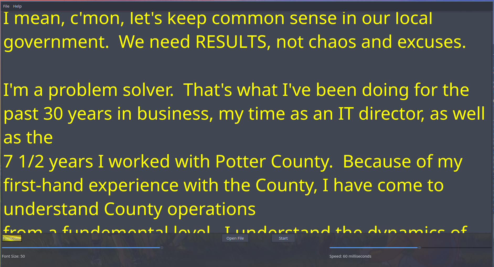

# JacksTeleprompter
A free basic Teleprompter I created while making a Qt5 C++ Tutorial.

Smoothly scrolls any text file.  

Adjustable scolling speeds on the fly.  

You can also set your font size and color.

Development environment is QT Creator running on OpenSUSE Tumbleweed Linux.

This is software is CopyLeft and is free to use by anyone.

## To Build JacksTeleprompter
git clone https://github.com/goHighMarketing/JacksTeleprompter.git

cd JacksTeleprompter/build

make

